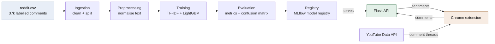

# YouTube Comment Audience Insights

An end-to-end sentiment analysis system for YouTube comments: a reproducible
DVC training pipeline, an MLflow-tracked LightGBM model, a Flask inference API,
and a Chrome extension that analyses the comments on whatever video you are
watching.

Open a YouTube video, click the extension, and get a sentiment breakdown of the
comment section — overall split, trend over time, word cloud, and the top
comments labelled individually.

---

## Contents

- [How it works](#how-it-works)
- [Model performance](#model-performance)
- [Repository layout](#repository-layout)
- [Quick start](#quick-start)
- [Configuration](#configuration)
- [API reference](#api-reference)
- [Tests and CI](#tests-and-ci)
- [Design notes](#design-notes)
- [Known limitations](#known-limitations)
- [License](#license)

---

## How it works



**Training** is a five-stage DVC pipeline. Each stage declares its inputs,
parameters, and outputs, so `dvc repro` re-runs only what a change actually
affects:

| Stage | Does | Output |
|---|---|---|
| `data_ingestion` | Drops nulls, duplicates, blanks; random 80/20 split | `data/raw/` |
| `data_preprocessing` | Lowercase, strip noise, remove stopwords, lemmatise | `data/preprocessed/` |
| `model_building` | Fit TF-IDF (1–3 grams, 1000 features), train LightGBM | `models/` |
| `model_evaluation` | Classification report, confusion matrix, log to MLflow | `data/evaluation/` |
| `model_registration` | Register the run and alias it `staging` | MLflow registry |

**Inference** runs in Flask. The extension pulls comment threads from the
YouTube Data API, posts them to `/predict_with_timestamps`, and renders the
results. Sentiment is one of three classes: negative (`-1`), neutral (`0`),
positive (`1`).

---

## Model performance

LightGBM over TF-IDF features, measured on the held-out 20% test split
(7,359 comments). These numbers come from the committed model and are
reproducible with `dvc repro`.

**Accuracy: 78.4%** · Macro F1: 0.766 · Weighted F1: 0.782

| Class | Precision | Recall | F1 | Support |
|---|---|---|---|---|
| Negative (−1) | 0.675 | 0.639 | 0.656 | 1,671 |
| Neutral (0) | 0.771 | 0.923 | 0.840 | 2,587 |
| Positive (1) | 0.863 | 0.747 | 0.801 | 3,101 |

**Confusion matrix** (rows actual, columns predicted):

|  | −1 | 0 | 1 |
|---|---|---|---|
| **−1** | **1067** | 305 | 299 |
| **0** | 132 | **2387** | 68 |
| **1** | 382 | 404 | **2315** |

The model is strongest on positive comments (0.863 precision) and weakest on
negative ones — negative is the smallest class (8,277 of 37,249 rows) and is
most often confused with neutral. `class_weight="balanced"` compensates
partially but does not close the gap. See
[Known limitations](#known-limitations).

---

## Repository layout

```
├── src/
│   ├── config.py              # env-driven settings, repo-root path helper
│   ├── preprocessing.py       # text normalisation shared by training + serving
│   ├── logging_utils.py       # shared logger setup
│   ├── data/
│   │   ├── data_ingestion.py
│   │   └── data_preprocessing.py
│   └── model/
│       ├── model_building.py
│       ├── model_evaluation.py
│       └── register_model.py
├── flask_api/main.py          # inference + visualisation endpoints
├── yt-chrome-plugin-frontend/ # Chrome extension (Manifest V3)
├── tests/                     # pytest suite
├── .github/workflows/ci.yml   # pyflakes + pytest on 3.10 / 3.11
├── dvc.yaml                   # pipeline definition
├── params.yaml                # hyperparameters
└── reddit.csv                 # labelled training data
```

`src/preprocessing.py` is deliberately shared by the pipeline and the API. If
training and serving normalise text differently, the model sees a different
distribution at inference time than it was trained on and predictions degrade
with no visible error. A test fails if a second copy is ever introduced.

---

## Quick start

### Requirements

Python 3.10+, and Google Chrome for the extension.

### 1. Install

```bash
git clone https://github.com/tinyu1295/SMA-Sentiment-Intelligence-Plugin.git
cd SMA-Sentiment-Intelligence-Plugin

python -m venv .venv && source .venv/bin/activate   # Windows: .venv\Scripts\activate
pip install -r requirements.txt
```

### 2. Reproduce the pipeline

```bash
dvc repro
```

This runs all five stages and writes the model to `models/`. By default MLflow
logs to a local `./mlruns` directory, so no hosted infrastructure is needed.
Individual stages can be run directly:

```bash
python -m src.data.data_ingestion
python -m src.model.model_building
```

### 3. Run the API

```bash
python -m flask_api.main
```

Serves on `http://127.0.0.1:8000`. It loads the model from the MLflow registry
and falls back to the committed `models/trained_model/lgbm_model.pkl` if the
registry is unreachable, so it works offline.

### 4. Load the extension

You need your own [YouTube Data API v3 key](https://console.cloud.google.com/apis/library/youtube.googleapis.com)
— the API is free within a generous daily quota.

1. Go to `chrome://extensions`, enable **Developer mode**, click
   **Load unpacked**, and select `yt-chrome-plugin-frontend/`.
2. Open any YouTube video and click the extension icon. On first run it asks
   for your API key and the backend URL.
3. The key is saved to `chrome.storage.sync` — per-browser, never written to
   the repository.

> **Note on the API key.** No key is committed to this repository, by design: an
> extension ships its source to every user, so an embedded key is readable by
> anyone who installs it. Restrict your key in the Google Cloud console to the
> YouTube Data API and set a quota cap. For a public release, proxy YouTube
> requests through the backend rather than calling the API from the popup.

---

## Configuration

Every deployment-specific value is read from the environment, with defaults that
work on a fresh clone:

| Variable | Default | Purpose |
|---|---|---|
| `MLFLOW_TRACKING_URI` | `file://./mlruns` | Tracking server; set to a remote URI to use a hosted one |
| `MLFLOW_EXPERIMENT_NAME` | `dvc-pipeline-runs` | Experiment to log under |
| `MODEL_NAME` | `yt_comment_judge_plugin_model` | Registered model name |
| `MODEL_VERSION` | `3` | Registry version the API serves |
| `RAW_DATA_PATH` | `./reddit.csv` | Source dataset |
| `FLASK_DEBUG` | off | Debug mode — **never enable on a public host** |
| `HOST` / `PORT` | `127.0.0.1` / `8000` | API bind address |

---

## API reference

All endpoints accept and return JSON unless noted.

| Endpoint | Method | Body | Returns |
|---|---|---|---|
| `/` | GET | — | Health check |
| `/predict` | POST | `{"comments": ["text", ...]}` | `[{comment, sentiment}]` |
| `/predict_with_timestamps` | POST | `{"comments": [{"text", "timestamp"}]}` | `[{comment, sentiment, timestamp}]` |
| `/generate_chart` | POST | `{"sentiment_counts": {"-1": n, "0": n, "1": n}}` | PNG pie chart |
| `/generate_wordcloud` | POST | `{"comments": ["text", ...]}` | PNG word cloud |
| `/generate_trend_graph` | POST | `{"sentiment_data": [{"timestamp", "sentiment"}]}` | PNG line chart |

```bash
curl -X POST http://127.0.0.1:8000/predict \
  -H 'Content-Type: application/json' \
  -d '{"comments": ["this video was fantastic", "complete waste of time"]}'
```

The extension calls `/predict_with_timestamps`, `/generate_wordcloud`, and
`/generate_trend_graph`, and renders the sentiment pie chart client-side with
Chart.js. It fetches up to 500 comments per video, 100 per API page.

---

## Tests and CI

```bash
pip install -r requirements-dev.txt
pytest
```

28 tests covering text normalisation, ingestion cleaning, parameter loading, and
configuration overrides. Three are regression guards rather than unit tests —
they fail if `preprocess_comment` is defined outside `src/preprocessing.py`, if
an infrastructure address is hardcoded under `src/`, or if a DVC stage reverts to
a bare script path (which breaks imports).

CI runs pyflakes and the suite against Python 3.10 and 3.11 on every push and
pull request.

---

## Design notes

**Why TF-IDF and LightGBM rather than a transformer.** The extension analyses up
to a few hundred comments per click and the user is waiting. A gradient-boosted
model over sparse features responds in milliseconds on CPU with no GPU and no
per-request model cost. A fine-tuned transformer would likely gain several
points of accuracy; it was not worth the latency and hosting cost here.

**Negations are preserved.** Standard stopword lists drop `not`, `no`, `but`,
`however`, and `yet` — the exact words that invert sentiment. `"not good"` and
`"good"` would normalise identically. Those five are explicitly kept.

**The vectorizer is fit on the training split only** and persisted alongside the
model, so no test-set vocabulary leaks into training.

**The API degrades rather than fails.** If the MLflow registry is unreachable the
server falls back to the committed local model, so the demo works offline.

---

## Known limitations

Honest list of what this does not do well:

- **Negative recall is 0.639.** Roughly a third of negative comments are missed,
  mostly classified as neutral. The training data is imbalanced (22% negative)
  and sarcasm — common in YouTube comments — is not handled at all.
- **Trained on Reddit, deployed on YouTube.** The labelled corpus is Reddit
  comments. The domains are similar but not identical, and no evaluation on
  labelled YouTube data has been done, so the reported accuracy is likely
  optimistic for the actual deployment.
- **English only, and not enforced.** The model is trained on English text, but
  the extension sends every comment it fetches, so non-English and emoji-only
  comments are scored anyway and the results are meaningless for them.
  Client-side language filtering is implemented but not yet merged.
- **No authentication on the API.** Fine for local use; a public deployment
  needs rate limiting and access control.
- **Comments are capped at 500 per video** (100 per YouTube API page), so large
  comment sections are sampled rather than analysed exhaustively — and the
  sample is the API's default ordering, not a random one.

### Possible next steps

- Evaluate on hand-labelled YouTube comments to measure the domain gap.
- Compare against a fine-tuned DistilBERT to quantify the accuracy/latency trade.
- Move the YouTube API key server-side and add rate limiting.
- Containerise the API and wire deployment into CI.

---

## License

MIT — see [LICENSE](LICENSE).
